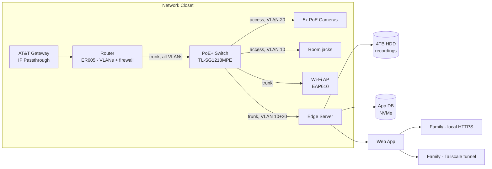

# ADU Smart System

A local-first security, networking, and smart-home platform for accessory dwelling units. Built for a family ADU first; designed to be repeatable for other homeowners and builders later.

## Table of contents

- [Goals](#goals)
- [Phases](#phases)
- [Hardware](#hardware)
- [Network design](#network-design)
- [Software stack](#software-stack)
- [Architecture](#architecture)
- [Repo structure](#repo-structure)
- [Getting started](#getting-started)
- [Requirements](#requirements)
- [Open items](#open-items)

## Goals

- **Local-first.** Recording, playback, and core function keep working with the internet down.
- **Vendor-neutral.** Ethernet, PoE, RTSP, and ONVIF — cameras and servers can be swapped without rework.
- **Secure by default.** Cameras have no route to the internet. Remote users reach the app, never a camera.
- **One app.** No vendor apps, no separate NVR UI for daily use.
- **Repeatable.** Standard hardware classes and one install sequence that another ADU can reuse.

## Phases

| Phase | What ships | Status |
|---|---|---|
| v1 — Hardware & recording | 5 cameras recording 24/7, VLANs, Frigate, remote viewing via tunnel, UPS, health alerts. No AI — continuous recording + Frigate motion detection only. | In progress |
| v2 — Homeowner app | FastAPI backend + Next.js web app: accounts, live grid, timeline, clip export, TV-browser support. | Planned |
| v3 — Expansion | Object detection (OpenVINO), sensor integrations (smoke/CO/gas/flood/door/stove) via the server API, off-site backup, installer image. | Planned |

## Hardware

| Component | Spec | Notes |
|---|---|---|
| Cameras | 5x Anpviz IPC-D3243W-S, 4MP PoE, ONVIF/RTSP | H.265 main stream, H.264 sub-stream |
| Cabling | Cat6A F/UTP shielded, 9 runs (5 camera, 4 room) | Shielded end-to-end: jacks, plugs, patch panel |
| PoE switch | TP-Link TL-SG1218MPE, 16-port PoE+, gigabit | 802.1Q VLAN tagging, 192W PoE budget |
| Router | TP-Link Omada ER605 | VLANs, inter-VLAN firewall/ACLs |
| Access point | TP-Link Omada EAP610 | WiFi 6, SSID-to-VLAN mapping |
| Edge server | N100/N95-class mini PC, 16GB RAM, 512GB NVMe | Runs Frigate + backend; Quick Sync decode, OpenVINO-ready for v3 AI |
| Storage | 4TB surveillance HDD, USB 3 dock | Separate volume from app data and any future family/IoT storage |
| Enclosure | 6U wall cabinet w/ thermostat fan | Patch panel (U1), switch (U2), shelf for router + mini PC (U3-U4) |
| UPS | 1000-1500VA, line-interactive | Feeds every device in the cabinet |

Full purchase ledger and pricing lives outside this repo (project tracking doc).

## Network design

Four VLANs, enforced at the router:

| VLAN | Purpose | Internet? | Reaches |
|---|---|---|---|
| 10 — Trusted | Family devices, server management | Yes | Everything (via the app; never direct to cameras/IoT) |
| 20 — Cameras | Cameras + server's camera-facing interface | No | Server only, on RTSP/ONVIF ports |
| 30 — IoT | Future sensors, smart TVs | Yes | Internet + server's MQTT/API ports only |
| 40 — Guest | Short-term guests | Yes | Internet only, fully isolated |

**Rule that never changes:** no port forwarded from the internet to any camera, admin page, SSH, or database. Remote users reach the app only, via a tunnel.

See [`docs/firewall-matrix.md`](docs/firewall-matrix.md) for the full source/destination rule table.

## Software stack

| Layer | Tool | License | Job |
|---|---|---|---|
| OS / containers | Debian + Docker Compose | Open source | Host + repeatable deploys |
| NVR | Frigate (+ go2rtc) | MIT | RTSP ingest, recording, live view, events |
| Messaging | Mosquitto (MQTT) | EPL/EDL | Frigate events now, sensors in v3 |
| Proxy / auth | Caddy | Apache-2.0 | HTTPS + login in front of the UI |
| Backend (v2) | FastAPI + PostgreSQL | MIT / PostgreSQL | Auth, camera config, clip metadata |
| Frontend (v2) | Next.js / React (PWA) | MIT | Phone, laptop, and TV-browser app |
| Remote access | Tailscale | Free tier | Encrypted tunnel, no open ports |
| Health | smartmontools, NUT, Uptime Kuma | GPL / MIT | Disk, UPS, and service alerts |
| Time | chrony | GPL | NTP for cameras with no internet route |
| Backup (v3) | restic | BSD | Optional encrypted off-site clip backup |

> **License note:** GPL tools above are used as unmodified, separate processes (monitoring/NTP), which is compliant even in a commercial product. Anything we fork, modify, or statically link must stay BSD/MIT/Apache — that's the line for a distributable product image.

## Architecture



**Video path:** camera encodes H.265 → switch (VLAN 20, untagged) → edge server → Frigate writes to disk, decodes only the small H.264 sub-stream for detection/live view → go2rtc serves browser-playable video → the app embeds it. The app never touches raw RTSP directly.

## Repo structure

```
.
├── README.md                    # this file
├── docker-compose.yml           # v1 stack: Frigate, Mosquitto, Caddy
├── docs/
│   ├── firewall-matrix.md       # full VLAN source/destination rules
│   └── frigate-config.example.yml
├── frigate/
│   └── config.yml               # actual Frigate config (gitignored: has credentials)
├── backend/                     # v2 — FastAPI app
└── frontend/                    # v2 — Next.js app
```

## Getting started

1. Flash Debian to the edge server, disable onboard Wi-Fi in BIOS/OS (server should only be reachable over its wired VLAN interfaces).
2. Install Docker + Docker Compose.
3. Copy `docs/frigate-config.example.yml` to `frigate/config.yml`, fill in each camera's RTSP credentials and ONVIF details.
4. `docker compose up -d` to bring up Frigate, Mosquitto, and Caddy.
5. Confirm all 5 cameras are recording and live view works in Frigate's own UI before building anything on top.
6. Configure the router (ER605) VLANs and firewall rules per the table above.
7. Configure the AP (EAP610) SSID-to-VLAN mapping.
8. (v2) Build the FastAPI backend + Next.js frontend against Frigate's API and go2rtc streams.

## Requirements

**Functional**
- 24/7 local recording from 5 cameras, minimum 1 week retention (current 4TB config: ~16 days at expected bitrate).
- Recording and local playback continue with no internet connection.
- One responsive web UI usable from phone, laptop, and smart TV browsers.
- Remote access via encrypted tunnel only — no exposed ports.
- Health alerts: camera offline, disk failing/full, UPS on battery, cabinet over-temperature, server down.

**Non-functional**
- All commercial-product code/dependencies must be BSD/MIT/Apache licensed (see license note above).
- Storage volumes for surveillance, app data, and future family/IoT data must be separate, each with independent retention.
- Server API must be extensible for future sensors (smoke/CO, gas, flood, door lock, stove) without a redesign.

## Open items

- [ ] AT&T install date and confirmed plan speed
- [ ] Final AP location (LR-02 vs. spare vs. attic camera)
- [ ] 30-day retention storage upgrade path (8TB+) — budget decision, not yet needed for v1
- [ ] Customer-facing remote access model for v3 (Tailscale doesn't scale to non-technical customers)
- [ ] Cabinet temperature sensor wiring + alert threshold
